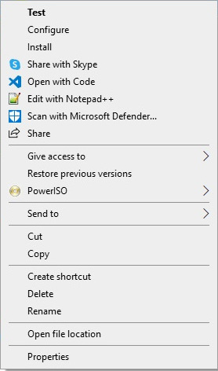
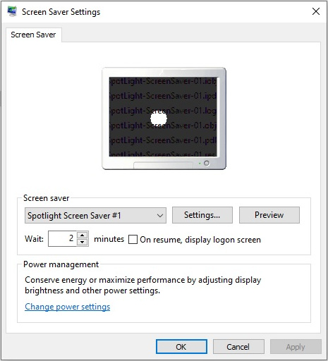
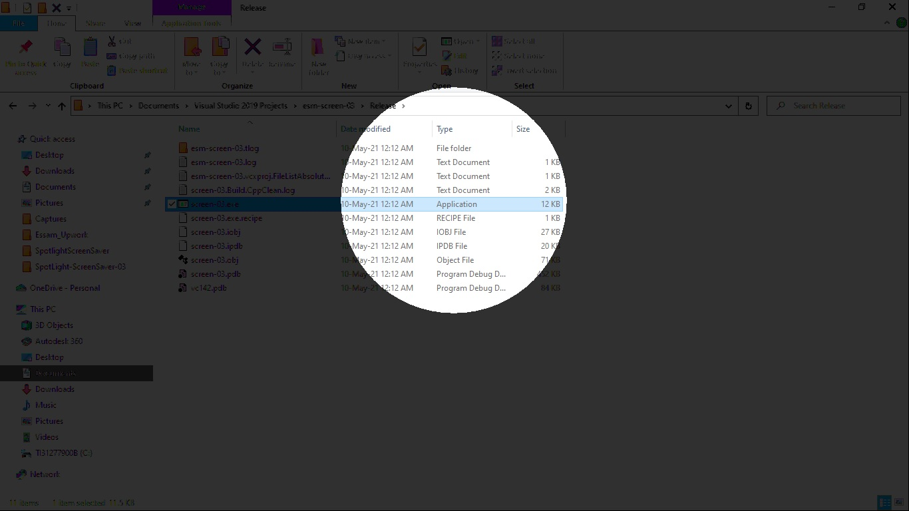
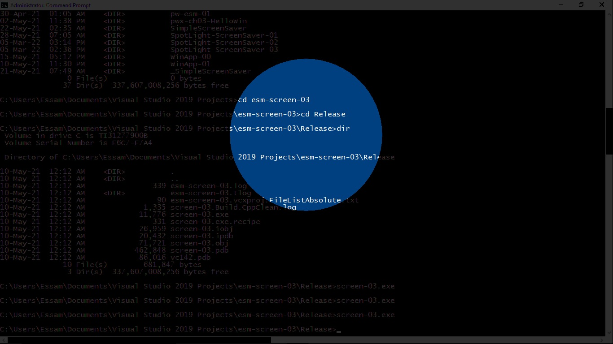

# SpotlightScreenSaver

A basic Windows Screen Saver written in C using Win32 API's. The Screen Saver implements the famous After Dark Screen Saver Spotlight module, where the desktop becomes dark/black and parts are "illuminated" by a randomly moving light spot. If you only have one monitor you have nothing to worry about, but those with two or more may notice oddities.

## References

* [Microsoft Documentation - Handling Screen Savers](https://docs.microsoft.com/en-us/windows/win32/lwef/screen-saver-library).
* [Microsoft Documentation - Screen Saver command-line arguments](https://docs.microsoft.com/en-us/troubleshoot/windows/win32/screen-saver-command-line).
* [Writing a Win32 Screen Saver](http://esaro.se/gamla/savers/sshow.html).
* [Wikipedia - After Dark software](https://en.wikipedia.org/wiki/After_Dark_(software)).

## Usage

In order to use this program, right click the executable .scr file. The following context menu will appear, where the first 3 commands () are relevant to the screen saver operation: 
<p> ... </p>

* **Test**: Run the Screen Saver.
* **Configure**: Show the Settings dialog box.
* **Install**: Installs the Screen Saver on your system.

## Preview

<p></p>
<p></p>

## Building

This software was built using **Microsoft Visual Studio Community 2019 | Microsoft Visual C++ 2019**

Compiling options

```
/permissive- /ifcOutput "Release\" /GS /GL /analyze- /W3 /Gy /Zc:wchar_t /Zi /Gm- /O2 /sdl /Fd"Release\vc142.pdb" /Zc:inline /fp:precise /D "WIN32" /D "NDEBUG" /D "_WINDOWS" /D "_UNICODE" /D "UNICODE" /errorReport:prompt /WX- /Zc:forScope /Gd /Oy- /Oi /MD /FC /Fa"Release\" /EHsc /nologo /Fo"Release\" /Fp"Release\SpotLight-ScreenSaver.pch" /diagnostics:column 
```

Linking options

```
/OUT:"C:\Users\Essam\Documents\Visual Studio 2019 Projects\SpotLight-ScreenSaver\Release\SpotLight-ScreenSaver.scr" /MANIFEST /LTCG:incremental /NXCOMPAT /PDB:"C:\Users\Essam\Documents\Visual Studio 2019 Projects\SpotLight-ScreenSaver\Release\SpotLight-ScreenSaver.pdb" /DYNAMICBASE "kernel32.lib" "user32.lib" "gdi32.lib" "winspool.lib" "comdlg32.lib" "advapi32.lib" "shell32.lib" "ole32.lib" "oleaut32.lib" "uuid.lib" "odbc32.lib" "odbccp32.lib" /DEBUG /MACHINE:X86 /OPT:REF /SAFESEH /INCREMENTAL:NO /PGD:"C:\Users\Essam\Documents\Visual Studio 2019 Projects\SpotLight-ScreenSaver\Release\SpotLight-ScreenSaver.pgd" /SUBSYSTEM:WINDOWS /MANIFESTUAC:"level='asInvoker' uiAccess='false'" /ManifestFile:"Release\SpotLight-ScreenSaver.scr.intermediate.manifest" /LTCGOUT:"Release\SpotLight-ScreenSaver.iobj" /OPT:ICF /ERRORREPORT:PROMPT /ILK:"Release\SpotLight-ScreenSaver.ilk" /NOLOGO /TLBID:1 
```

## License

This software is licensed under the GPL license, see the LICENSE file.

